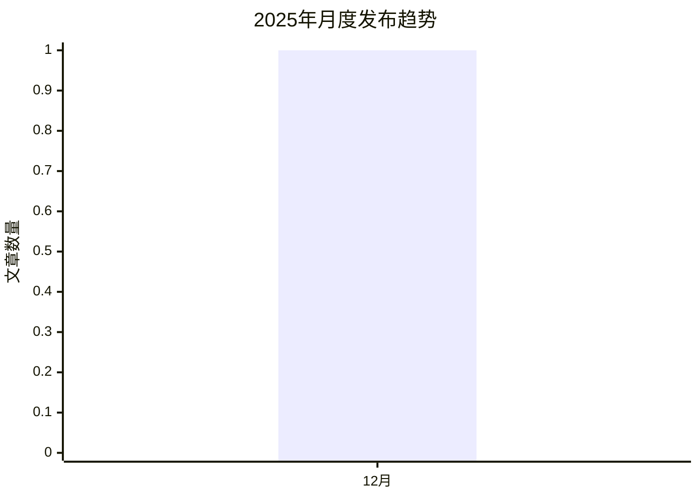

# 太阳鸟的AI宝藏库 - 2025年度总结 🎉

> 本文档是基于微信公众号「太阳鸟的AI宝藏库」2025年全年文章数据自动生成的年度总结报告。

---

## 📊 年度数据概览

- **总文章数**: 1 篇
- **总阅读量**: 0 次
- **总点赞数**: 0 个
- **总评论数**: 0 条
- **平均阅读**: 0 次/篇
- **平均点赞**: 0 个/篇
- **生成时间**: 2025-12-27

---

## 🏆 年度榜单

### 🔥 获赞最高 Top 10

1. ****
   - 📅 发布日期: 2025-12-25
   - 👁️ 阅读: 0 | 👍 点赞: 0 | 💬 评论: 0

---

### 💬 评论最多 Top 10

1. ****
   - 📅 发布日期: 2025-12-25
   - 👁️ 阅读: 0 | 👍 点赞: 0 | 💬 评论: 0

---

### 📖 阅读最多 Top 10

1. ****
   - 📅 发布日期: 2025-12-25
   - 👁️ 阅读: 0 | 👍 点赞: 0 | 💬 评论: 0

---

## 📈 数据分析

### 月度发布趋势

### 月度详细数据

| 月份 | 文章数 | 总阅读 | 总点赞 | 总评论 |
|------|--------|--------|--------|--------|
| 2025-12 | 1 | 0 | 0 | 0 |

---

### 分类统计 Top 10

| 排名 | 分类 | 文章数 | 总阅读 | 总点赞 | 总评论 |
|------|------|--------|--------|--------|--------|
| 1 | 其他 | 1 | 0 | 0 | 0 |

---

## 💡 年度总结

### 创作成果

在2025年,我们共创作了 **1** 篇文章,累计获得了:

- 📖 **0** 次阅读
- 👍 **0** 个点赞
- 💬 **0** 条评论

### 高光时刻

- **最高产月份**: 2025-12 (1 篇)
- **最受欢迎文章**: 
  - 阅读量: 0
- **最受认可文章**: 
  - 点赞数: 0

---

## 🎯 展望2026

感谢每一位读者的支持和陪伴!在新的一年里,我们将继续为大家带来更多优质的AI相关内容。

如果你也对AI感兴趣,欢迎关注公众号「太阳鸟的AI宝藏库」!

---

**持续更新中... 欢迎关注公众号获取最新内容!**

Made with ❤️ by 太阳鸟

