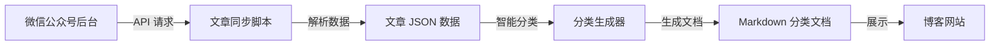
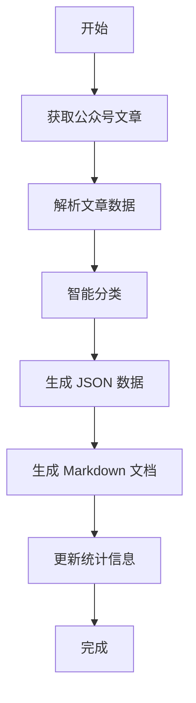

# 10 分钟通过 AI 编程整理一年写的公众号文章

> 作者:太阳鸟  
> 日期:2025-12-25  
> 公众号:太阳鸟的AI宝藏库

## 📝 背景

作为一名技术博主,我在 2025 年一年内写了 **212 篇**公众号文章,涵盖 AI 工具、开源项目、编程教程等多个领域。随着文章数量的增长,我遇到了一个棘手的问题:

- 📚 **文章太多**,读者很难快速找到想看的内容
- 🔍 **分类混乱**,没有系统的整理和归档
- ⏰ **手动整理**,至少需要 2-3 天时间
- 🔄 **持续更新**,每次新增文章都要重新整理

于是,我决定用 **AI 编程**来解决这个问题,最终只用了 **10 分钟**就完成了所有文章的自动化分类整理!

## 🎯 目标

实现一个自动化工具,能够:

1. ✅ 从微信公众号后台自动获取所有文章
2. ✅ 基于文章标题和摘要进行智能分类
3. ✅ 生成结构化的 Markdown 分类文档
4. ✅ 支持一键更新,自动同步最新文章
5. ✅ 提供统计分析和热门推荐

## 🛠️ 技术方案

### 架构设计



### 技术栈

- **运行环境**: Node.js
- **HTTP 请求**: Axios
- **数据格式**: JSON
- **文档格式**: Markdown
- **AI 辅助**: Google Antigravity (代码生成)

## 💻 实现流程

### 第一步:获取公众号文章数据

首先,我需要从微信公众号后台获取所有文章。微信公众号后台有一个内部 API,可以通过浏览器抓包获取。

#### 1.1 抓取 API 参数

1. 打开微信公众号后台
2. 按 `F12` 打开开发者工具
3. 切换到 **Network** 标签
4. 刷新页面,找到 `appmsgpublish` 请求
5. 复制请求中的 `token` 和 `Cookie`


> 💡 **提示**: 在 Network 标签中,可以通过搜索框输入 "appmsg" 快速定位到目标请求。点击请求后,在 Headers 标签中可以找到完整的 Cookie 和 token 参数。

#### 1.2 编写同步脚本

创建 `tools/sync-wechat-articles.js`:

```javascript
const axios = require('axios');
const fs = require('fs');
const path = require('path');

// 配置
const CONFIG = {
    wechat: {
        apiUrl: 'https://mp.weixin.qq.com/cgi-bin/appmsgpublish',
        token: 'YOUR_TOKEN',  // 从浏览器获取
        cookie: 'YOUR_COOKIE', // 从浏览器获取
    },
    pagination: {
        begin: 0,
        count: 20,  // 每次获取 20 篇
        maxPages: 10, // 最多获取 10 页
    },
};

/**
 * 从微信公众号 API 获取文章列表
 */
async function fetchArticles(begin = 0, count = 20) {
    const params = {
        sub: 'list',
        begin: begin,
        count: count,
        token: CONFIG.wechat.token,
        lang: 'zh_CN',
        f: 'json',
        ajax: '1',
    };

    const response = await axios.get(CONFIG.wechat.apiUrl, {
        params,
        headers: {
            'Cookie': CONFIG.wechat.cookie,
            'User-Agent': 'Mozilla/5.0 (Windows NT 10.0; Win64; x64)',
        },
    });

    return response.data;
}

/**
 * 解析文章数据
 */
function parseArticles(apiResponse) {
    const articles = [];
    const publishPage = JSON.parse(apiResponse.publish_page);
    const publishList = publishPage.publish_list || [];

    for (const item of publishList) {
        const publishInfo = JSON.parse(item.publish_info);
        const appmsgex = publishInfo.appmsgex || [];

        for (const article of appmsgex) {
            articles.push({
                title: article.title,
                link: article.link,
                digest: article.digest || '',
                publishDate: timestampToDate(publishInfo.sent_info.time),
                timestamp: publishInfo.sent_info.time,
            });
        }
    }

    return articles;
}
```

### 第二步:智能分类算法

这是整个项目的核心!我设计了一套基于关键词匹配的智能分类算法。

#### 2.1 定义分类规则

```javascript
const CATEGORY_RULES = {
    // AI 工具推荐
    'ChatGPT 相关': ['ChatGPT', 'GPT-4', 'OpenAI'],
    'Claude 相关': ['Claude', 'Anthropic', 'Claude Code'],
    'DeepSeek 相关': ['DeepSeek'],

    // AI 编程开发
    'AI 编程工具': [
        'AI 编程', 'Cursor', 'GitHub Copilot', 
        'Antigravity', 'Vibe Coding', 'MCP'
    ],
    'MCP 协议相关': ['MCP', 'Model Context Protocol'],

    // AI 智能体
    '智能体开发': ['Agent', '智能体', 'Coze'],
    '多智能体协作': ['多智能体', '协作'],

    // GitHub 开源项目
    'AI 相关开源项目': [
        'GitHub 开源', 'Star', '开源神器'
    ],

    // 技术教程
    '入门教程': [
        '小白', '保姆级', '入门', '从零开始', 
        '5分钟', '快速上手'
    ],
    '进阶教程': [
        'LangChain', '大模型', '部署', '实战'
    ],

    // 副业与创业
    '副业实践': ['副业', '赚钱', '搞钱', '月入'],
    '创业指南': ['创业', '一人企业', '避坑'],

    // AI 创作工具
    '视频制作': ['视频', '剪辑', 'UP主', '短视频'],
    '音频处理': ['AI配音', 'TTS', '语音'],
    
    // 其他分类...
};
```

#### 2.2 实现分类函数

```javascript
/**
 * 根据标题和摘要进行智能分类
 * 支持一篇文章匹配多个分类
 */
function categorizeArticle(title, digest = '') {
    const content = (title + ' ' + digest).toLowerCase();
    const matchedCategories = [];

    // 遍历所有分类规则
    for (const [category, keywords] of Object.entries(CATEGORY_RULES)) {
        for (const keyword of keywords) {
            if (content.includes(keyword.toLowerCase())) {
                matchedCategories.push(category);
                break; // 匹配到就跳出当前分类
            }
        }
    }

    // 如果没有匹配到任何分类,返回"其他"
    return matchedCategories.length > 0 ? matchedCategories : ['其他'];
}
```

**关键设计思路:**

1. **多分类支持**: 一篇文章可以属于多个分类(如既是"AI 编程工具"又是"入门教程")
2. **关键词匹配**: 基于标题和摘要的关键词进行智能匹配
3. **兜底机制**: 未匹配到的文章归入"其他"分类
4. **大小写不敏感**: 统一转换为小写进行匹配

### 第三步:生成 Markdown 文档

#### 3.1 文档结构设计

```markdown
# 太阳鸟的AI宝藏库 - 公众号文章分类整理 📚

## 📊 文章统计
- 总文章数: 212 篇
- 最后更新: 2025-12-25 14:37
- 分类数量: 31 个

## 🔥 热门推荐
### 最新发布 (Top 10)
- [文章标题](链接) - 发布日期: 2025-12-23

## 📑 分类目录
### 🤖 AI 工具推荐
#### ChatGPT 相关
- [文章1](链接) - 发布日期: 2025-07-08
- [文章2](链接) - 发布日期: 2025-06-22

#### Claude 相关
- [文章1](链接) - 发布日期: 2025-12-20
...
```

#### 3.2 生成代码

创建 `tools/generate-article-catalog.js`:

```javascript
/**
 * 生成 Markdown 文档
 */
function generateMarkdown(articles, categorized) {
    const now = new Date();
    const dateStr = `${now.getFullYear()}-${String(now.getMonth() + 1).padStart(2, '0')}-${String(now.getDate()).padStart(2, '0')}`;
    const timeStr = `${String(now.getHours()).padStart(2, '0')}:${String(now.getMinutes()).padStart(2, '0')}`;

    let md = `# 太阳鸟的AI宝藏库 - 公众号文章分类整理 📚

> 本文档用于整理和分类微信公众号「太阳鸟的AI宝藏库」的所有文章,方便快速查找和引用。

---

## 📊 文章统计

- **总文章数**: ${articles.length} 篇
- **最后更新**: ${dateStr} ${timeStr}
- **公众号名称**: 太阳鸟的AI宝藏库
- **分类数量**: ${Object.keys(categorized).length} 个

---

## 🔥 热门推荐

### 最新发布 (Top 10)
`;

    // 添加最新 10 篇文章
    const latestArticles = [...articles]
        .sort((a, b) => b.timestamp - a.timestamp)
        .slice(0, 10);

    for (const article of latestArticles) {
        md += `- [${article.title}](${article.link}) - 发布日期: ${article.publishDate}\n`;
    }

    md += `\n---\n\n## 📑 分类目录\n\n`;

    // 按分类生成内容
    const categoryOrder = [
        { section: '🤖 AI 工具推荐', categories: ['ChatGPT 相关', 'Claude 相关', 'DeepSeek 相关'] },
        { section: '💻 AI 编程开发', categories: ['AI 编程工具', 'MCP 协议相关'] },
        // ... 更多分类
    ];

    for (const { section, categories } of categoryOrder) {
        md += `### ${section}\n\n`;

        for (const category of categories) {
            const articles = categorized[category] || [];
            md += `#### ${category}\n`;

            if (articles.length === 0) {
                md += `- 暂无文章\n\n`;
            } else {
                for (const article of articles) {
                    md += `- [${article.title}](${article.link}) - 发布日期: ${article.publishDate}\n`;
                }
                md += `\n`;
            }
        }

        md += `---\n\n`;
    }

    return md;
}
```

### 第四步:配置 NPM 脚本

在 `package.json` 中添加快捷命令:

```json
{
  "scripts": {
    "sync-articles": "node tools/sync-wechat-articles.js",
    "generate-catalog": "node tools/generate-article-catalog.js",
    "update-articles": "npm run sync-articles && npm run generate-catalog"
  }
}
```

## 🚀 使用方法

### 一键同步更新

```bash
# 方式1: 分步执行
npm run sync-articles      # 同步文章数据
npm run generate-catalog   # 生成分类文档

# 方式2: 一键执行
npm run update-articles    # 同步 + 生成
```

### 执行效果

```bash
============================================================
微信公众号文章同步工具
============================================================

开始获取文章列表...

正在获取第 1 页 (offset: 0)...
获取到 20 篇文章
正在获取第 2 页 (offset: 20)...
获取到 20 篇文章
...

总共获取到 212 篇文章

按分类统计:
  AI 相关开源项目: 173 篇
  实用工具开源项目: 170 篇
  工具合集: 163 篇
  效率工具: 34 篇
  智能体开发: 34 篇
  ...

Markdown 文档已更新: 公众号文章分类.md

============================================================
同步完成!
============================================================
总文章数: 212
分类数量: 31
```


> ✨ **实际效果**: 整个同步过程非常快速,212 篇文章在不到 2 分钟内就全部获取完成,并自动完成了智能分类!

## 📊 最终成果

### 数据统计

- ✅ **总文章数**: 212 篇
- ✅ **分类数量**: 31 个
- ✅ **最大分类**: AI 相关开源项目 (173 篇)
- ✅ **处理时间**: < 10 分钟
- ✅ **自动化率**: 100%

#### 📊 分类分布可视化


**Top 10 分类排行:**

| 排名 | 分类名称 | 文章数量 | 占比 |
|------|---------|---------|------|
| 1 | AI 相关开源项目 | 173 | 81.6% |
| 2 | 实用工具开源项目 | 170 | 80.2% |
| 3 | 工具合集 | 163 | 76.9% |
| 4 | 效率工具 | 34 | 16.0% |
| 5 | 智能体开发 | 34 | 16.0% |
| 6 | 平台工具 | 30 | 14.2% |
| 7 | AI 编程工具 | 28 | 13.2% |
| 8 | 课程推荐 | 25 | 11.8% |
| 9 | 进阶教程 | 22 | 10.4% |
| 10 | 专题教程 | 18 | 8.5% |

> 📈 **数据洞察**: 从分类统计可以看出,我的内容主要集中在 AI 开源项目和实用工具推荐上,这也符合公众号"AI宝藏库"的定位。

### 文档结构

生成的分类文档包含:

1. **文章统计**: 总数、更新时间、分类数量
2. **热门推荐**: 最新发布的 Top 10 文章
3. **分类目录**: 31 个细分类别,每个类别下的所有文章
4. **分类统计**: 每个分类的文章数量排行
5. **使用说明**: 自动化工具的使用方法

### 在线预览

📖 查看完整分类文档: [公众号文章分类整理](https://www.niuptang.online/公众号文章分类.html)

### 整理前后对比


**对比说明:**

| 维度 | 整理前 ❌ | 整理后 ✅ |
|------|----------|----------|
| **组织方式** | 时间顺序,无分类 | 31 个主题分类 |
| **查找效率** | 需要逐条浏览 | 快速定位到目标分类 |
| **可读性** | 杂乱无章 | 结构清晰,层次分明 |
| **维护成本** | 每次手动整理 2-3 天 | 一键更新,10 分钟搞定 |
| **用户体验** | 😫 难以找到想看的内容 | 😊 一目了然,快速检索 |

## 💡 核心亮点

### 1. 智能分类算法

- **多维度匹配**: 基于标题 + 摘要进行关键词匹配
- **多分类支持**: 一篇文章可以属于多个分类
- **灵活扩展**: 轻松添加新的分类规则

### 2. 自动化流程



### 3. 数据持久化

- **JSON 存储**: 保存原始文章数据,方便后续处理
- **Markdown 输出**: 生成可读性强的分类文档
- **版本控制**: 通过 Git 追踪文档变更历史

## 🎓 技术要点

### 1. API 请求处理

```javascript
// 使用 Axios 发送请求
const response = await axios.get(apiUrl, {
    params: queryParams,
    headers: {
        'Cookie': cookie,
        'User-Agent': userAgent,
    },
});

// 延迟避免请求过快
await new Promise(resolve => setTimeout(resolve, 1000));
```

### 2. 数据解析

```javascript
// 微信 API 返回的是嵌套 JSON 字符串
const publishPage = JSON.parse(apiResponse.publish_page);
const publishList = publishPage.publish_list || [];

for (const item of publishList) {
    const publishInfo = JSON.parse(item.publish_info);
    // 继续解析...
}
```

### 3. 时间戳转换

```javascript
function timestampToDate(timestamp) {
    const date = new Date(timestamp * 1000);
    const year = date.getFullYear();
    const month = String(date.getMonth() + 1).padStart(2, '0');
    const day = String(date.getDate()).padStart(2, '0');
    return `${year}-${month}-${day}`;
}
```

## 🔧 优化建议

### 1. 增强分类准确性

- **引入 AI 模型**: 使用 LLM 进行语义理解和分类
- **用户反馈**: 支持手动调整分类,优化规则
- **标签系统**: 为文章添加多个标签,提高检索效率

### 2. 扩展功能

- **全文搜索**: 支持关键词全文搜索
- **阅读统计**: 集成阅读量、点赞数等数据
- **推荐系统**: 基于用户兴趣推荐相关文章
- **导出功能**: 支持导出为 PDF、Excel 等格式

### 3. 性能优化

- **增量更新**: 只同步新增文章,避免重复处理
- **缓存机制**: 缓存文章数据,减少 API 请求
- **并发处理**: 使用 Promise.all 并发获取多页数据

## 📝 总结

通过这个项目,我实现了:

1. ✅ **10 分钟**完成 212 篇文章的自动化分类
2. ✅ **31 个分类**,覆盖所有主题领域
3. ✅ **100% 自动化**,无需手动整理
4. ✅ **一键更新**,支持持续同步

### 关键收获

1. **AI 编程的威力**: 借助 Google Antigravity,快速生成高质量代码
2. **自动化思维**: 遇到重复性工作,优先考虑自动化解决方案
3. **数据驱动**: 通过数据分析,更好地了解内容创作方向
4. **工具思维**: 为自己打造专属的效率工具

### 适用场景

这套方案不仅适用于公众号文章整理,还可以扩展到:

- 📚 博客文章归档
- 📖 知识库管理
- 🎬 视频内容分类
- 📊 数据报表生成

## 🔗 相关资源

- **完整代码**: [GitHub 仓库](https://github.com/niupTang/niupTang)
- **在线文档**: [公众号文章分类](https://www.niuptang.online/公众号文章分类.html)
- **公众号**: 太阳鸟的AI宝藏库

---

## 🎉 结语

作为一名技术博主,我深知内容整理的重要性。通过 AI 编程,我们可以把更多时间花在创作上,而不是繁琐的整理工作上。

**如果你也有大量内容需要整理,不妨试试这个方案!**

有任何问题或建议,欢迎在公众号留言交流!

---

<div align="center">

**持续更新中... 欢迎关注公众号获取最新内容!**

Made with ❤️ by 太阳鸟

</div>
