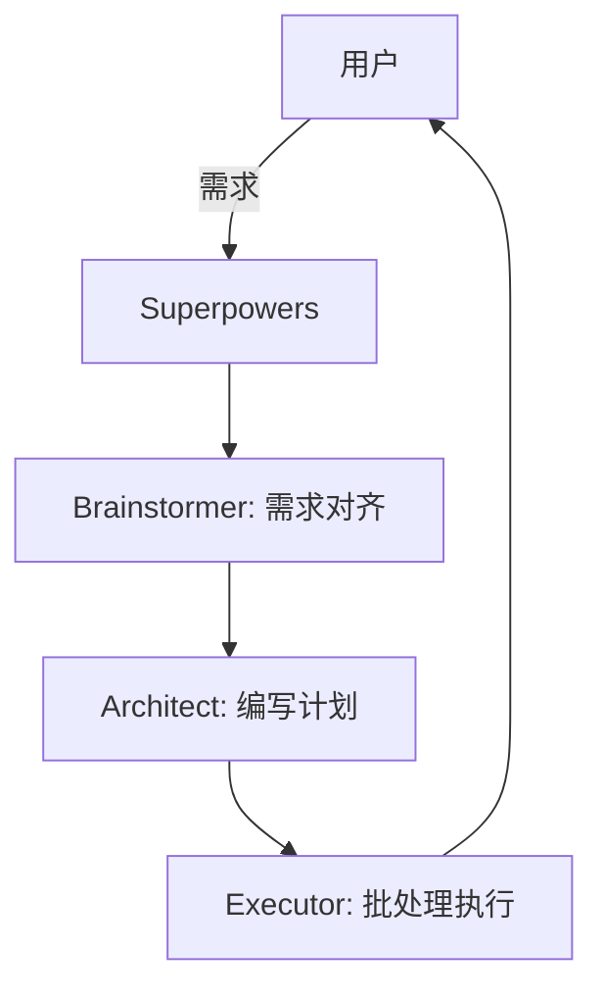

点击上方🔺公众号🔺关注我✅

大家好，我是牛皮糖！

最近 Claude Code 彻底火出圈了，大家都在感叹它的编程能力。但随之而来的也有不少吐槽：**「虽然它很强，但有时候像个没头苍蝇，一上来就乱改代码，完全不按我的套路来！」** 或者 **「我想让它先帮我梳理逻辑，它却直接给我写了 500 行 Bug...」**

其实，问题不在于 Claude Code 不够聪明，而在于我们把它当成了一个「全能苦力」，而不是一个「研发团队」。

今天，我就给大家安利一个 GitHub 上的宝藏项目——**[Superpowers](https://github.com/obra/superpowers)**。它能帮你把 Claude Code 这种巨型工具，优雅地拆解成一个个听话、专业的「小助手」。

---

## 一、 问题分析：为什么你需要“拆分” AI 助手？

### 1. 架构师视角：认知负荷与上下文偏移
从系统设计高度来看，大模型在处理复杂请求时容易产生两个问题：
- **认知过载**：一次性给出的指令太复杂，AI 往往会顾头不顾腚。
- **上下文偏移**：在长对话中，初始的项目规范（如“必须写 TDD 测试”）容易被遗忘。

### 2. 需求本质：从“原子指令”到“角色模型”
我们需要的不是一个能写代码的对话框，而是一套**具备角色的协作流程**。

---

## 二、 方案设计：Superpowers 的核心魔法

**Superpowers** 不仅仅是一个插件，它提供了一套基于 **Agentic Skills** 的开发方法论。

### 核心架构图：SDD (Subagent-Driven-Development)


### 关键决策说明
Superpowers 将开发流程拆分为三个关键阶段：
1. **Brainstorm (头脑风暴)**：不写代码，只聊需求。直到 AI 完全理解你的意图。
2. **Write Plan (制定计划)**：生成一份详细的中期文档，包含待办列表。
3. **Execute (执行计划)**：按照计划进行受控的代码修改。

---

## 三、 代码实现：如何把你的 Claude Code 变成团队？

### 3.1 一键集成（以 Claude Code 为例）
在你的终端输入以下命令：

```bash
# 注册 Superpowers 商店
/plugin marketplace add obra/superpowers-marketplace

# 安装 Superpowers 核心包
/plugin install superpowers@superpowers-marketplace
```

### 3.2 唤醒你的“小助手”
安装完成后，你不再是面对一个空白的对话框，而是拥有了以下指令：

- **`/superpowers:brainstorm`**：唤起「需求分析师」。它会不断追问你细节，直到生成一份你满意的 Spec 文档。
- **`/superpowers:write-plan`**：唤起「架构师」。它会基于 Spec 制定详细的 TDD（测试驱动开发）计划。
- **`/superpowers:execute-plan`**：唤起「初级程序员」。它只负责埋头干活，严格遵循架构师定义的计划。

### 实战小技巧：自定义 AGENTS.md
你甚至可以在项目根目录通过 `AGENTS.md` 定义这些小助手的脾气、代码风格和技术偏好。

---

## 四、 部署建议与总结

### 1. 适用平台
- **Claude Code**：通过内置插件系统，体验最佳。
- **OpenCode**：支持外部指令注入，灵活性高。

### 2. 监控点
在执行过程中，建议观察控制台输出的 `batch execution` 进度。如果 AI 开始偏离路径，随时通过 `CTRL+C` 中断，并让「架构师」修正计划。

---

## 结语

以前我们用 AI，是**「我在前面冲，它在后面补」**。
用了 Superpowers 之后，变成了**「它在前面排兵布阵，我在后面点下‘确认’键」**。

如果你觉得现在的 AI 工具太难驾驭，不妨试试这套「小助手拆解法」。

---

**[niupTang 专栏]** 专注于 AI 进阶开发玩法。

**想要获取 Superpowers 全套中文配置指令集吗？**
点击「在看」，后台回复「**小助手**」即可获取我整理的 SDD 实战手册！

---

**牛皮糖**  
AI 工具探索者 | 高级技术专家  
【添加微信，带你进入 AI 编程进阶圈】
