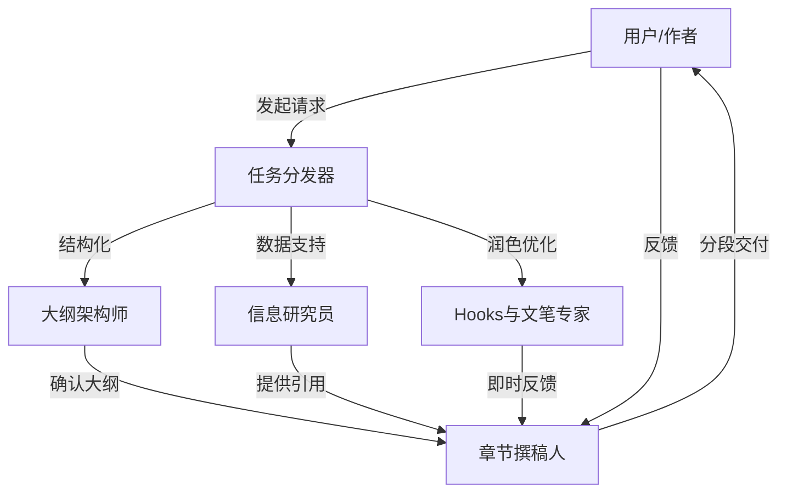

在 AI 辅助写作的道路上，我们经历了从简单的 "Chat"（聊天）到 "Copilot"（副驾驶）的演变。大多数人使用 ChatGPT 或 Claude 的方式仍然停留在“给我写一篇文章”的指令式交互上。然而，对于深度长文、技术文档或高质量的思想领导力文章，这种“一键生成”的模式往往不仅无法满足需求，反而会带来内容空洞、逻辑断层甚至幻觉问题。

今天，我们将从**架构设计**和**工程实现**的角度，拆解一个名为 **"Content Research Writer"** 的 AI Skill。这不是一个简单的提示词，而是一个微型的、具有伪 Agent 特性的写作系统。它将颠覆你的写作流程，把 AI 从“代笔者”变成真正的“写作搭档”。

<!-- more -->

## 问题分析：为什么“一键生成”行不通？

在构建高质量写作 Agent 之前，我们需要先深入理解当前 LLM（大语言模型）在长文本生成中面临的核心挑战：

### 1. 上下文与注意力的稀释
LLM 的注意力机制虽然强大，但在长文本生成中，随着 token 数量的增加，模型对早期指令的遵循度会下降。如果要求模型一次性输出 3000 字的文章，它往往在后半段会“忘记”你定义的语气或核心论点。

### 2. “幻觉”与事实核查的缺失
简单的生成指令缺乏**研究（Research）**环节。模型倾向于根据概率预测下一个词，而不是基于事实。对于需要引用数据、论文或案例的文章，这种机制是致命的。

### 3. 缺乏“思考”的结构化
人类专家的写作流程通常是：`灵感 -> 调研 -> 大纲 -> 初稿 -> 修改`。而“一键生成”试图跳过中间步骤直接得到结果，这违反了复杂任务的工程学原理（Chain of Thought）。

---

## 方案设计：打造“交互式”写作流

为了解决上述问题，"Content Research Writer" Skill 采用了一种**交互式、分阶段**的架构设计。它不仅仅是一个 Prompt，而是一套定义了**角色、工具和工作流**的协议。

### 核心架构图

我们不把 AI看作单一的生成器，而是将其拆解为四个协同工作的“虚拟职能”：



### 关键设计决策

1.  **状态保持（State Management）**：
    *   **Outline as State**：大纲不仅仅是开始的计划，而是贯穿全流程的“地图”。
    *   **Research Log**：独立的引用/研究记录，确保所有论据都有据可查。

2.  **分片执行（Chunked Execution）**：
    *   强制执行“逐节写作”模式。不是一次性生成全文，而是 user 写一段，AI 反馈一段；或者 AI 写一段，user 确认一段。这保持了高精度的上下文控制。

3.  **风格对齐（Style Alignment）**：
    *   引入“声音克隆”机制，即通过分析用户过往文本，提取语气特征，而不是简单地使用“专业”或“幽默”这种模糊的形容词。

---

## 代码实现：Prompt Engineering 的艺术

这个 Skill 的核心在于并在 Prompt 中固化了上述设计。以下是其实现的几个关键模块分析。

### 1. 角色定义与能力边界

在 System Prompt 的开篇，必须明确界定 AI 的身份并非“替代者”，而是“合作伙伴”。

```markdown
# Content Research Writer

This skill acts as your writing partner, helping you research, outline, draft, and refine content while maintaining your unique voice and style.

## What This Skill Does
1. Collaborative Outlining: Helps you structure ideas
2. Research Assistance: Finds relevant information and adds citations
3. Section Feedback: Reviews each section as you write
...
```

**解析**：这里使用了**声明式（Declarative）**的定义，清晰列举了 7 大核心能力。这有助于模型在后续交互中准确调用对应的“技能树”。

### 2. 结构化工作流指令

最精彩的部分在于它定义了一套标准化的交互流程（Protocol）。

```markdown
## Instructions

1. **Understand the Writing Project**
   Ask clarifying questions: Topic, Audience, Format, Goal...

2. **Collaborative Outlining**
   Help structure the content...
   
   ## Hook
   ## Introduction
   ## Main Sections
   ## Research To-Do  <-- 关键点：将研究任务显性化
```

**解析**：
*   **Clarifying Questions（澄清问题）**：这是高级 Prompt 的标志。不要急于生成，先通过提问对齐需求。
*   **Research To-Do**：在大纲阶段就通过 `[ ]` CheckBox 的形式规划研究任务，强制模型进行“元认知”思考——我知道什么？我还需要查什么？

### 3. 反馈循环的模版化

为了保证反馈质量，Skill 定义了严格的反馈输出格式：

```markdown
# Feedback: [Section Name]

## What Works Well ✓
...

## Suggestions for Improvement
### Clarity
Original: > [Exact quote]
Suggested: > [Improved version]
Why: [Explanation]
```

**解析**：这种 `Original -> Suggested -> Why` 的结构借鉴了代码 Code Review 的最佳实践。它不仅给结果，还给理由，极大地提升了用户的接受度和学习效果。

### 4. 引用管理（Citation Management）

针对幻觉问题，引入了严格的引用格式控制：

```markdown
**Inline Citations**:
Studies show 40% productivity improvement (McKinsey, 2024).

**Reference List**:
Maintain a running citations list.
```

这要求模型在处理信息时必须进行“来源标记”，如果模型编造数据，用户在检查引用列表时很容易发现（因为找不到对应的 source）。

---

## 最佳实践与部署建议

要在你的工作流中部署这个 Skill，我有以下建议：

### 1. 工具链选择
*   **Claude Projects / Cursor**：强烈推荐在支持长上下文和文件上传的环境中使用。你可以创建一个 `knowledge.md` 文件，放入你的过往文章，让 AI 学习你的文风。
*   **Obsidian / VS Code**：按照文中的建议，在本地建立 `draft.md`, `research.md`, `outline.md` 的文件结构，配合 AI 编程助手（如 Copilot 或 Cursor）使用。

### 2. 迭代式写作流
不要试图一次吃成胖子。
*   **Step 1**: "Help me outline an article about X." -> 确认大纲。
*   **Step 2**: "Research key statistics for Section 1." -> 确认数据。
*   **Step 3**: "I've written the intro, critique it." -> 获得反馈。
*   **Step 4**: "Draft Section 2 based on the research." -> 生成内容。

### 3. Human-in-the-loop
始终记住，你是主编。AI 是记者和研究员。最后的审稿权、语气定调权在你手中。如果发现 AI 的语气变味了，立即使用指令："Stop. This sounds too robotic. Re-write in a more conversational tone, like I'm talking to a friend."

---

## 结语

**Content Research Writer** 不仅仅是一个 Prompt，它是 **Agentic Workflow**（智能体工作流）在写作领域的典型应用。它展示了如何通过结构化的指令设计，弥补大模型在长逻辑、事实性和个性化方面的短板。

在这个 AI 泛滥的时代，**稀缺的不再是内容本身，而是独特的观点和深度的研究**。掌握这个 Skill，你将拥有一个不知疲倦的顶级研究助理，助你从“内容生成者”进阶为“内容架构师”。
