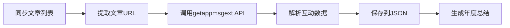

# 2025年度总结使用指南 📖

## 快速开始

### 第一步: 获取必要的参数

在使用脚本之前,需要从微信公众号后台获取一些参数:

#### 1. 获取 `key` 参数

1. 打开微信公众号后台: https://mp.weixin.qq.com
2. 登录后,点击任意一篇文章查看
3. 按 `F12` 打开浏览器开发者工具
4. 切换到 **Network** 标签
5. 刷新页面,在请求列表中找到 `getappmsgext` 请求
6. 点击该请求,查看 **Query String Parameters**
7. 复制 `key` 参数的值

> ⚠️ **注意**: `key` 参数每2小时过期,需要重新获取

#### 2. 获取 Cookie

在同一个 `getappmsgext` 请求中:
1. 切换到 **Headers** 标签
2. 找到 **Request Headers** 部分
3. 复制完整的 `Cookie` 值

#### 3. 配置参数

打开 `tools/fetch-article-stats.js` 文件,找到配置部分:

```javascript
const CONFIG = {
    wechat: {
        apiUrl: 'https://mp.weixin.qq.com/mp/getappmsgext',
        key: '', // 👈 粘贴你获取的 key
        uin: '', // 从 Cookie 中提取 wxuin 的值
        pass_ticket: '', // 从请求参数中获取
        cookie: '', // 👈 粘贴完整的 Cookie
    },
    // ...
};
```

### 第二步: 运行脚本

#### 方案A: 分步执行(推荐,便于调试)

```bash
# 1. 同步文章列表(如果已有最新数据可跳过)
npm run sync-articles

# 2. 获取文章互动数据(点赞、评论、阅读)
npm run fetch-stats

# 3. 生成年度总结
npm run year-summary
```

#### 方案B: 一键执行

```bash
npm run full-summary
```

### 第三步: 查看结果

生成的年度总结文档位于项目根目录:
- `2025年度总结.md`

## 输出内容

年度总结包含以下内容:

### 📊 年度数据概览
- 总文章数
- 总阅读量
- 总点赞数
- 总评论数
- 平均数据

### 🏆 年度榜单
- 🔥 获赞最高 Top 10
- 💬 评论最多 Top 10
- 📖 阅读最多 Top 10

### 📈 数据分析
- 月度发布趋势图
- 月度详细数据表
- 分类统计 Top 10

### 💡 年度总结
- 创作成果
- 高光时刻
- 展望未来

## 常见问题

### Q1: 提示 "key 参数过期" 怎么办?

**A**: `key` 参数每2小时过期,需要重新从浏览器获取。按照"第一步"的说明重新获取并更新配置文件。

### Q2: 获取数据时出现 403 错误?

**A**: 可能是以下原因:
1. Cookie 过期,需要重新获取
2. 请求过快被限流,脚本已设置1秒延迟,如仍出错可增加延迟时间

### Q3: 部分文章获取失败怎么办?

**A**: 脚本会自动重试3次,如果仍然失败,会将该文章的互动数据设为0。可以:
1. 检查网络连接
2. 稍后重新运行 `npm run fetch-stats`
3. 手动补充数据

### Q4: 如何只更新某些文章的数据?

**A**: 可以修改 `tools/fetch-article-stats.js` 中的逻辑,添加过滤条件,例如只获取最近一个月的文章。

### Q5: 数据保存在哪里?

**A**: 
- 原始文章数据: `wechat-articles.json`
- 带互动数据的文章: `wechat-articles-with-stats.json`
- 年度总结文档: `2025年度总结.md`

## 技术说明

### 数据获取流程



### API 说明

使用的是微信公众号的非官方API:
- **端点**: `https://mp.weixin.qq.com/mp/getappmsgext`
- **返回数据**:
  - `read_num`: 阅读数
  - `like_num`: 在看数
  - `old_like_num`: 点赞数
  - `comment_count`: 评论数

### 限制说明

1. **请求频率**: 脚本设置了1秒延迟,避免请求过快
2. **Key有效期**: 2小时,过期需重新获取
3. **数据准确性**: 使用非官方API,数据可能与后台略有差异

## 进阶使用

### 自定义年度总结

可以修改 `tools/generate-year-summary.js` 来自定义输出内容:

```javascript
// 修改 Top N 数量
.slice(0, 20)  // 改为 Top 20

// 添加新的统计维度
// 例如:按作者统计、按标签统计等
```

### 导出其他格式

可以基于生成的 Markdown 文档转换为其他格式:
- PDF: 使用 Pandoc 或在线工具
- HTML: 使用 Markdown 渲染器
- Excel: 提取数据表格部分

## 更新日志

### v1.0.0 (2025-12-26)
- ✅ 实现文章互动数据获取
- ✅ 实现年度总结自动生成
- ✅ 支持获赞、评论、阅读排行榜
- ✅ 支持月度趋势分析
- ✅ 支持分类统计

## 相关资源

- [微信公众号后台](https://mp.weixin.qq.com)
- [项目 GitHub](https://github.com/niupTang/niupTang)
- [公众号: 太阳鸟的AI宝藏库](https://www.niuptang.online)

---

如有问题,欢迎在公众号留言或提交 Issue!
